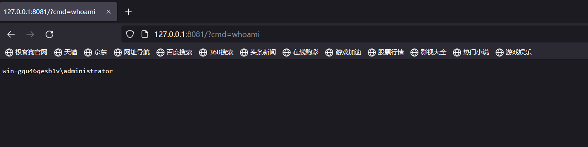
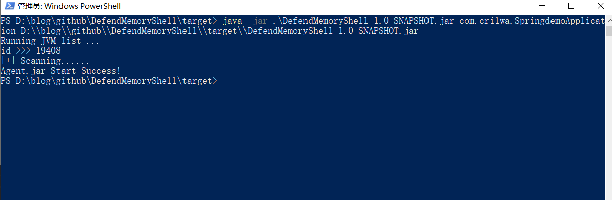
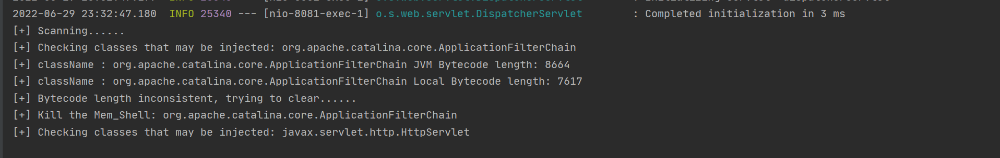
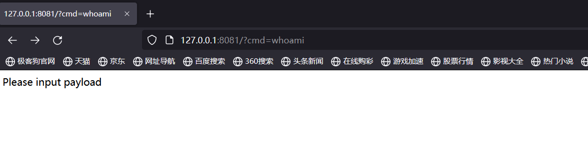

# DefendMemoryShell

## 介绍

这是一款内存马清除工具，支持以下功能

- 白名单功能
- 黑名单功能
- 发现后自动清除内存马

## 如何使用

maven打包成jar后，命令行直接启动

```shell
java -jar .\DefendMemoryShell-1.0-SNAPSHOT.jar com.crilwa.SpringdemoApplication D:\\blog\\github\\DefendMemoryShell\\target\\DefendMemoryShell-1.0-SNAPSHOT.jar
```

- args[0]，目标项目，springboot之类的
- args[1]，打包好的jar路径

### 自定义配置

#### 黑名单

| 危险类路径                                      | 注释       |
| ----------------------------------------------- | ---------- |
| org.apache.catalina.core.ApplicationFilterChain | 常见注入类 |
| javax.servlet.http.HttpServlet                  | 冰蝎马     |

#### 白名单

| 保护类路径   | 注释         |
| ------------ | ------------ |
| 根据需求设定 | 根据需求设定 |
|              |              |

## 工具演示

先注入常见的javaAgent内存马



然后执行我们的工具进行清除





再次访问页面，无法再执行命令了，清除成功



## 免责声明

该工具仅仅作为学习交流使用，使用该工具造成的一切损失自行负责。

